# Slack Emoji

To add one to Slack: **Settings & administration -> Customize workspace -> Add Custom Emoji**, upload the file, and give it the name shown beside it.

| Emoji | Name |
| :---: | --- |
| 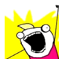 | `:all-the-things:` |
|  | `:always-has-been:` |
|  | [`:blank:`](https://twitter.com/tenderlove/status/1032299379707863040) |
| 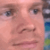 | `:blinking-guy:` |
|  | `:blob_no:` |
| 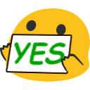 | `:blob_yes:` |
|  | `:business-cat:` |
| 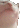 | `:cat-jam:` |
| 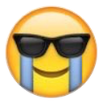 | `:cool-crying:` |
|  | `:deal-with-it:` |
| 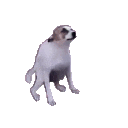 | `:dog-dance:` |
| 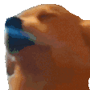 | `:dog-jam:` |
|  | `:done:` |
| 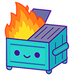 | `:dumpster-fire:` |
|  | `:elmo-fire:` |
| 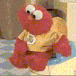 | `:elmo-potty:` |
|  | `:evil-kermit:` |
|  | `:extreme-teamwork:` |
| 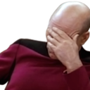 | `:facepalm:` |
| 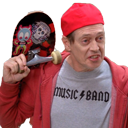 | `:fellow-kids:` |
| 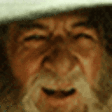 | `:gandalf-nod:` |
|  | `:gasp-cat:` |
| 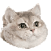 | `:heavybreathing:` |
| 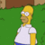 | `:homer-disappear:` |
|  | `:lolsob:` |
| 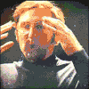 | `:mind-blown:` |
| 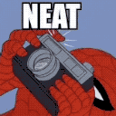 | `:neat-spiderman:` |
| 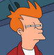 | `:not-sure:` |
|  | `:oh-no:` |
|  | `:oh-no-blob:` |
|  | `:oh-no-bubble:` |
|  | `:parrot_conga:` |
| 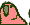 | `:parrot_conga_reverse:` |
| 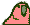 | `:parrot_shuffle:` |
|  | `:parrot_shuffle_further:` |
|  | `:parrot_wave_1:` |
| 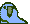 | `:parrot_wave_2:` |
|  | `:parrot_wave_3:` |
|  | `:parrot_wave_4:` |
| 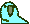 | `:parrot_wave_5:` |
| 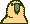 | `:parrot_wave_6:` |
|  | `:parrot_wave_7:` |
|  | `:party_blob:` |
|  | `:party_cat:` |
| 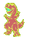 | `:party_dino:` |
|  | `:party_doh:` |
| 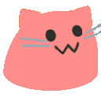 | `:party_meow:` |
|  | `:party_parrot:` |
|  | `:party_sheepy:` |
|  | `:party_wfh:` |
| 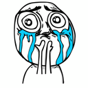 | `:so-cute:` |
| 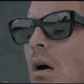 | `:sunglasses-shock:` |
| 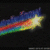 | `:the-more-you-know:` |
| 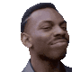 | `:think-about-it:` |
|  | `:this-is-fine:` |
| 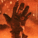 | `:thumbs-up-fire:` |
|  | `:try-not-to-cry:` |
|  | `:ty:` |
|  | `:typing-cat:` |
| 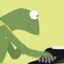 | `:typing-kermit:` |
| 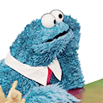 | `:waiting:` |
|  | `:why-not-both:` |
|  | `:wtf-tom:` |
